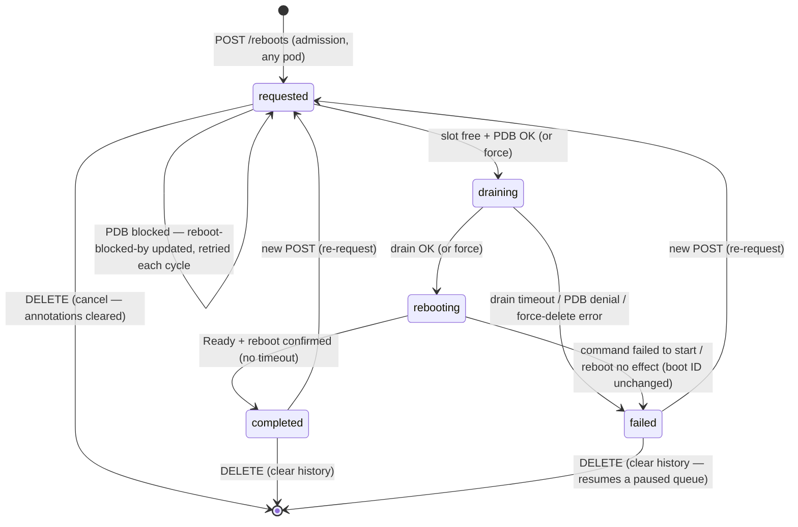

# PLAN — simplek8s-controller

Phase: **PLAN** (design & planning). Status: v4, reviewed (incl. external
review and follow-up), pending final sign-off.

## 1. Purpose

A node-management controller for a self-built Kubernetes cluster
(SimpleK8s distro: Buildroot, systemd, containerd, kubeadm). It runs as a
privileged DaemonSet with one instance per node and provides operational
capabilities over the hosts.

**First feature (v1): scheduled node reboots**, with:

1. An internal HTTP REST API to schedule reboots for selected nodes.
2. A configurable limit on concurrently rebooting nodes (default: **1**).
3. Wait until a node is available again before starting the next reboot.
4. Do not reboot a node if a PodDisruptionBudget would be violated,
   unless the request passes `force`.
5. All nodes are rebootable, control-plane included (no policy flag in
   v1 — a `deny` option can be added later when needed).

The controller is intended to grow: reboot scheduling is only the first
capability. The layout (feature packages, engine, API groups) must stay
extensible (see 3.9).

## 2. Constraints

- **Go 1.27, stdlib only.** No client-go, no controller-runtime, no other
  third-party dependencies. Kubernetes API access is done with a minimal
  in-house REST client over HTTPS.
- **In-cluster credentials**: the standard serviceaccount mount
  (`/var/run/secrets/kubernetes.io/serviceaccount/{token,ca.crt,namespace}`),
  path configurable. Token rotation handled by re-reading the file on
  each request (the kubelet keeps the file fresh).
- **Production cluster.** Every deploy and test runs against the real
  cluster. Rollout discipline: validate on a single non-critical worker
  node first; control-plane reboots only after full validation.
- Code and docs in English. Repo: `github.com/simplek8s/simplek8s-controller`
  (project: simplek8s.org). No environment-specific details (hostnames,
  IPs) in committed files.

## 3. Design

### 3.1 Deployment model: DaemonSet + global orchestrator

- One `simplek8s-controller` pod per node.
- Pod is `privileged: true` + `hostPID: true`, so it can `nsenter` into
  the host's PID 1 (systemd) and issue the actual `reboot`.
- **Two roles, one binary:**
  - **Orchestrator** (global, single actor): elected via a
    `coordination.k8s.io/v1` Lease `simplek8s-controller-leader`
    (leader election: renew every 10 s, takeover when `renewTime` is
    stale > 30 s, `holderIdentity` = `<pod-name>/<pod-uid>`). The Lease
    guarantees at most one pod *believes* it is leader, not that only
    one *acts*: if the leader's renewal is delayed (GC pause, API
    latency > 30 s), a successor can take over while the old leader is
    still running its loop. Mitigation: before **each** lifecycle
    transition patch the orchestrator renews the Lease and aborts the
    action if it no longer holds it; a rare one-cycle overshoot of the
    concurrency limit during a handover race is still possible and
    accepted. The
    orchestrator is the **sole decision-maker and sole writer of
    lifecycle states**: it owns the queue, the concurrency limit, PDB
    checks, drain (evictions are API calls — they do not need to be
    local), and the `completed`/`failed` transitions. The Lease name is
    deliberately generic: it leads the *controller*, not the reboot
    feature; future features are orchestrated by the same leader.
  - **Local executor** (one per node, all pods): watches its own node.
    Its actions: when its node is `rebooting`, record the host boot ID
    (`reboot-boot-id`), write the `reboot-issued-at` marker and run
    `nsenter -t 1 -m -u -i -n -p -- reboot` (the reboot command must be
    local — nsenter reaches only the local host). While its node is
    `rebooting` it verifies the reboot actually happened: host boot ID
    changed vs `reboot-boot-id` ⇒ write `reboot-confirmed-at`; unchanged
    past `--reboot-issue-grace` ⇒ mark `failed` ("reboot did not take
    effect"). If the command fails to start, it marks the node `failed`
    with the error.
- Every other pod for a given node is a pure observer (API, health).
- `nsenter` only reaches the local host ⇒ the reboot *command* is local;
  everything else is centralized in the orchestrator. This eliminates
  cross-pod races on the queue (single writer) — see 3.5.
- **Single-control-plane outage behavior**: while the only CP is
  rebooting, the API server is down. Pods simply skip engine cycles (log
  rate-limited to one line per up→down transition; no state writes,
  nothing marked `failed`) and the API returns 503. While the API is
  down the worker orchestrator **cannot renew its Lease**; when the API
  answers again the Lease is stale and leadership typically transfers
  (any API outage > 30 s has the same effect). The new leader re-reads
  everything from annotations and completes the transition: the
  `completed` rule (3.4) relies on `reboot-confirmed-at` (written by the
  node's own pod once it is scheduled again) or on an observed
  `NotReady` — never on a fresh `lastTransitionTime`, which is exactly
  what is unreliable in this scenario.
- When a CP node reboots, the local pod dies and comes back with the
  DaemonSet; the state machine is **fully recoverable from API-server
  state alone**.

### 3.2 Kubernetes access: minimal REST client (`internal/kube`)

Stdlib `net/http` + `crypto/tls` + `encoding/json`. Required verbs
(v1 scope):

| Verb | Where | Notes |
|---|---|---|
| GET | `nodes`, `pods` (all ns), `poddisruptionbudgets`, `leases`, API `/healthz` | Pagination via `limit` + `continue`; retry on 429/5xx |
| PATCH | `nodes/{name}` | `application/merge-patch+json` with `metadata.resourceVersion` for optimistic concurrency |
| CREATE (POST) | `namespaces/{ns}/pods/{pod}/eviction` | `policy/v1` Eviction body; 202 = pending, 429 = denied (PDB/grace) |
| DELETE | `pods/{pod}` | Fallback for `force` drain |
| CREATE/UPDATE | `leases/{simplek8s-controller-leader}` | Leader election (get → create or update with holder identity/renewTime) |
| CREATE | `events` (namespaced, regarding the Node) | One Event per state transition |

- TLS: CA from the serviceaccount `ca.crt`; endpoint from
  `KUBERNETES_SERVICE_HOST`/`KUBERNETES_SERVICE_PORT` env (standard
  in-cluster) or `--kube-apiserver` flag.
- Auth: `Authorization: Bearer <token>`, token re-read from file per
  request (rotation-safe).
- No `watch` in v1 — the engine polls (default 2 s). Reboot operations
  are measured in minutes, not milliseconds; polling is far simpler to
  get right with a hand-rolled client (no resync/reconnect edge cases)
  and trivially robust. Watch can be added later if the cluster grows.
- Hand-written minimal types (only the fields we use): `Node`
  (spec.unschedulable, status.conditions, metadata), `Pod` (phase,
  nodeName, ownerReferences, labels, deletionTimestamp, spec.volumes for
  the local-storage report), `PodDisruptionBudget`, `Lease`, list
  envelopes with `resourceVersion`/`continue`.
- Small retry wrapper: exponential backoff for 429/503, honor
  `Retry-After`; context deadlines everywhere.

### 3.3 Reboot state: annotations on `Node`

No CRDs (MVP, stdlib-only). State per node in `Node` annotations:

| Annotation | Format | Meaning |
|---|---|---|
| `simplek8s.org/reboot-state` | `requested` \| `draining` \| `rebooting` \| `completed` \| `failed` | Current lifecycle state. A **string enum, not a timestamp**; its presence means the node participates in the reboot lifecycle. |
| `simplek8s.org/reboot-request-id` | `<RFC3339>-<6 random>` | Correlates one API request with its execution |
| `simplek8s.org/reboot-requested-at` | RFC3339 | When the request was admitted (queue ordering) |
| `simplek8s.org/reboot-state-since` | RFC3339 | When the node entered its current state (drives the drain timeout; human display) |
| `simplek8s.org/reboot-requested-by` | text (optional) | Origin of the request (from the API body) |
| `simplek8s.org/reboot-force` | `true`/`false` | Request bypasses PDB checks |
| `simplek8s.org/reboot-cordoned-prev` | `true` | Node was already cordoned before we started (do not uncordon on completion) |
| `simplek8s.org/reboot-blocked-by` | comma-separated `ns/pdb` | PDBs currently blocking the node (only while `requested` and blocked) |
| `simplek8s.org/reboot-issued-at` | RFC3339 | Local pod issued the reboot command (written just before `nsenter`) |
| `simplek8s.org/reboot-boot-id` | hex | Host boot ID (`/proc/sys/kernel/random/boot_id`, kernel-global, readable by the pod) recorded just before the reboot is issued |
| `simplek8s.org/reboot-confirmed-at` | RFC3339 | Local pod verified the host boot ID changed after the reboot (evidence the reboot really happened) |
| `simplek8s.org/reboot-error` | text | Last error (state `failed`) |

- `reboot-state` is the only state marker; the rest are attributes of the
  current request/state.
- Queue = nodes in `requested`, ordered by `reboot-requested-at`; ties
  broken by **workers before control planes**, then node name. With a
  single orchestrator the ordering is respected except for read-staleness
  of at most one cycle.
- In-flight = nodes in `draining` or `rebooting`.
- **Writer rule**: the orchestrator writes all transitions
  (`requested → draining → rebooting → completed/failed`); any pod may
  perform absent→`requested` (API admission) and deletions per 3.10; the
  local pod may write `reboot-boot-id`, `reboot-confirmed-at`, and mark
  `failed` on a failed or no-effect reboot. All writes are atomic merge
  patches including `resourceVersion`; losers of a race re-read. Node
  status updates (~10 s, kubelet) bump `resourceVersion` often, so on 409
  the writer re-reads and re-patches **immediately within the same
  cycle**, not on the next poll.
- `completed`/`failed` remain as history until cleared (DELETE) or
  replaced by a new request.

### 3.4 State machine (per node)



While `rebooting`, the node's local pod records the host boot ID,
issues `nsenter … reboot`, and later writes `reboot-confirmed-at` when
the boot ID has changed (see 3.5 step 5).

A node deleted from the cluster exits the machine entirely: its state
disappears with it, and the orchestrator continues without error (3.4,
"Node disappears mid-plan").

Rules:

- **`completed`**: orchestrator sees `rebooting` + node `Ready` +
  evidence that the reboot really happened ⇒ `completed`, and uncordons
  the node if the controller cordoned it. Evidence: the local pod wrote
  `reboot-confirmed-at` (host boot ID changed vs `reboot-boot-id`), or
  the orchestrator observed the node `NotReady` at least once after
  `reboot-issued-at`. This stays correct in the single-CP case without
  trusting condition `lastTransitionTime`: while the API was down no
  `NotReady` is observable, but the node's own pod writes
  `reboot-confirmed-at` as soon as it is scheduled again. It also closes
  the no-effect hole: a `reboot` command that is accepted but never
  reboots the host can never produce `completed`, because the boot ID
  never changes (and the grace rule below fails the node).
- **No reappearance timeout (KISS)**: a node stays `rebooting` until it
  is `Ready` again. A node that never comes back is visible through the
  platform itself (`NotReady` node + `NodeNotReady` events) *and* the
  `rebooting` annotation; it keeps its slot, so the queue does not
  advance. The operator's escape is `DELETE /reboots/{node}` (see 3.10)
  — "stop watching this node". No `lost` state, no give-up timer.
- **`failed`** occurs only on definite errors: drain timeout (e.g. pod
  stuck `Terminating` on finalizers), PDB-denied eviction without
  `force`, force-delete error, the reboot command failing to start, or
  the reboot having no effect (host boot ID unchanged
  `--reboot-issue-grace` after `reboot-issued-at`, detected by the
  local pod — distinguished from "node has not reappeared"). On
  `failed` the orchestrator uncordons the node if it cordoned it.
- **Queue pause on failure**: with `--on-reboot-failure=pause` (default),
  the orchestrator stops admitting new nodes while any node is
  `failed`; it resumes when the operator clears the `failed` state via
  `DELETE`. `--on-reboot-failure=continue` advances to the next node
  immediately. Rationale: a failed reboot may indicate a defective
  distro build; continuing could brick the rest of the fleet.
- **PDB-blocked** is not a failure: the node stays `requested`, the
  blocking PDBs are recorded, and the check is retried each cycle.
- **Queue hold on `NotReady`**: if any node still in `requested` (queued,
  reboot not yet issued) is `NotReady`, the orchestrator holds the whole
  queue (no slot acquisition) and logs/Events rate-limited; it resumes
  when every queued node is `Ready` again. A `NotReady` node is never
  drained — eviction on a dead node cannot work — and admission (3.9)
  only accepts `Ready` nodes, so this catches nodes that went `NotReady`
  after admission. Nodes already `draining`/`rebooting` keep their own
  rules (drain timeout / no timeout).
- **Node disappears mid-plan**: state lives in the node's annotations,
  so a node deleted from the cluster loses its state with the object.
  The orchestrator never treats disappearance as an error, never
  pauses or holds the queue because of it, and keeps no in-memory
  per-node state for nodes that are gone — every cycle is derived
  purely from the current node list. A node that disappears while
  `draining` or `rebooting` simply frees its slot; one that disappears
  while `failed` clears the pause condition. One log line (rate-
  limited) + an Event on detection.
- **Crash/leader recovery**: all state is in annotations; on leader
  takeover the new orchestrator re-reads everything and continues. A
  node in `rebooting` without `reboot-issued-at` (local pod died before
  issuing) is issued by the local pod on its next cycle — issuing is
  idempotent. The boot-ID checks (`reboot-boot-id` /
  `reboot-confirmed-at` / no-effect failure) are annotation-driven, so
  they survive pod and leader restarts. A node in `draining` past
  `--reboot-drain-timeout` is marked `failed` and uncordoned.
- **Lease during `rebooting` of the leader's own node**: the leader dies
  with the host; the next leader takes over after ~30 s. Expected and
  benign.

### 3.5 Reboot flow

1. **Admission** (API, any pod): see 3.10. Patches absent→`requested`
   (409/422 otherwise).
2. **Slot acquisition** (orchestrator, ~2 s loop): while in-flight count
   < `--max-concurrent-reboots` (with at most
   `--max-concurrent-cp-reboots` of them being control-plane nodes) and
   the queue is not paused or held (3.4), take the oldest `requested`
   node and patch it to `draining`. Single writer — no races (Lease
   re-validated before every transition patch, 3.1).
3. **PDB check** (orchestrator, skipped if `force`): see 3.7. It runs
   *before* cording: a blocked node stays `requested`, records
   `reboot-blocked-by`, and is **never cordoned**.
4. **Drain** (orchestrator, only after the PDB check passed):
   - Cordon (`spec.unschedulable=true`), recording `reboot-cordoned-prev`
     if it was already cordoned.
   - Evict pods via the **Eviction API** (`policy/v1`), skipping
     daemonset-managed pods, mirror pods of static pods (ownerReference
     of kind `Pod` — the API objects of CP static pods; they are never
     evicted), and already-terminating pods. Eviction is
     asynchronous: 202 = pending (pod goes away up to
     `terminationGracePeriodSeconds` later), 429 = denied (PDB/grace) —
     the drain loop distinguishes pending / denied / gone. A PDB-denied
     eviction without `force` aborts the drain → `failed`.
   - With `force`: after eviction attempts, `DELETE` remaining
     evictable pods (aggressive; documented).
   - **No local-storage gate** (unlike `kubectl drain`): a reboot
     destroys node-local ephemeral storage anyway, so gating on it would
     protect against an inevitable outcome. Documented prominently:
     *scheduling a reboot wipes the node's local ephemeral storage*.
   - Wait until no evictable pods remain on the node (timeout
     `--reboot-drain-timeout` → `failed` + uncordon).
   - **Control-plane nodes**: static pods (kube-apiserver, etcd,
     controller-manager, scheduler) are not evicted; the kubelet
     recreates them after reboot. Only user/addon pods are drained.
5. **Reboot**: orchestrator patches the node to `rebooting`. The local
   pod (next cycle) records the host boot ID in `reboot-boot-id`
   (`/proc/sys/kernel/random/boot_id` is kernel-global, so the pod
   reads it directly), writes `reboot-issued-at`, and runs
   `nsenter -t 1 -m -u -i -n -p -- reboot`. If the command fails to
   start (binary missing, permissions), the local pod marks `failed`
   with the error. Reboot verification is annotation-driven and
   idempotent: while the state is `rebooting`, the node's local pod
   compares the current boot ID with `reboot-boot-id` — changed ⇒ writes
   `reboot-confirmed-at`; unchanged for `--reboot-issue-grace` ⇒ marks
   `failed` ("reboot did not take effect"), the "command succeeded but
   the host never rebooted" path. A host that is genuinely down cannot
   fire this check (its pod is dead), so slow boots are never false-
   failed.
6. **Wait for reappearance**: orchestrator, per 3.4 — until `Ready`
   again, no timeout. The local pod restarts with the node and writes
   `reboot-confirmed-at` once the boot ID has changed; the orchestrator
   (or its successor) completes `completed` per the verification rule
   in 3.4.

### 3.6 "All nodes blocked" — the cluster cannot wedge

- The PDB check happens *before* cording, so a blocked node is never
  cordoned and nothing on it changes. Worst case: the node stays
  `requested` until the operator acts; the cluster keeps running
  normally.
- At most `--max-concurrent-reboots` nodes are cordoned at any time —
  exactly the ones actively draining/rebooting.
- Visibility: `reboot-blocked-by` and `GET /reboots` show exactly which
  PDBs block which node.
- Escapes: fix the workload/PDB (scale up, lower `minAvailable`),
  `DELETE` the request, or re-issue with `force` (bypasses the check;
  the Eviction API still denies protected evictions and `force` falls
  back to direct pod deletion — documented as aggressive).

### 3.7 PDB evaluation per node

For target node N, over every PDB in the cluster (pod label selector):

1. Select pods cluster-wide matching the PDB's selector (phase
   Running, not terminating).
2. `disruptableOnN` = selected pods running on N that the drain would
   remove (excluding daemonset pods).
3. `available` = selected available pods (per PDB definition: running and
   ready) minus disruptions in progress.
4. Blocked if `|disruptableOnN| > 0` and
   `available − |disruptableOnN| < minAvailable` (or the PDB disallows
   disruption of incomplete pods and N hosts incomplete selected pods).
5. `force=true` → skip the check; the Eviction API remains the final
   arbiter (denied evictions handled per 3.5 step 4).

MVP: direct computation (list pods + list PDBs, in-memory). Fine for
small clusters. The in-memory pre-check and the server-side Eviction API
can diverge (different views of available/disruptions); the API is the
arbiter. Tests must cover deliberate divergence, not just the happy
path.

### 3.8 Extensibility

The controller is a platform for node-management features. Structure:

```
cmd/simplek8s-controller/   wiring, flags, lifecycle
internal/kube/              minimal k8s REST client + types
internal/nodestate/         annotation read/write, state types
internal/engine/            leader election, orchestrator loop, local loop
internal/api/               HTTP server: registered route groups
internal/features/reboot/   v1 feature: drain, pdb, rebooter, task, routes
deploy/                     kustomize (SA, RBAC, DaemonSet, Service)
```

- Each feature = one package registering (a) an orchestrator task,
  (b) a local executor, and (c) API routes under
  `/api/v1/<feature>/...`. Adding feature #2 must not touch the reboot
  feature; the leader is feature-agnostic (runs registered tasks).
- The kube client is feature-agnostic; new verbs are added as methods.

### 3.9 HTTP API (per instance)

| Method | Route | Description |
|---|---|---|
| POST | `/api/v1/reboots` | `{"nodes":["n1","n2"],"force":false,"requestedBy":"..."}`; `"nodes":["*"]` = all nodes (workers queued first, CPs last). → `requested`. 202. |
| GET | `/api/v1/reboots` | The plan: every node that has a reboot state — in-flight (`requested`/`draining`/`rebooting`) plus `completed`/`failed` history until cleared (state, since, force, blockedBy, error, issued). Nodes without state are not listed. |
| GET | `/api/v1/reboots/{node}` | State of one node. 404 if the node has no reboot state. |
| DELETE | `/api/v1/reboots/{node}` | `requested`: cancel. `rebooting`: stop watching (operator escape for a node that never returns). `completed`/`failed`: clear history (also resumes a paused queue). `draining`: 409 (an in-flight drain is not interruptible; if it fails the node is `failed` and the plan pauses). No state: 404. |
| GET | `/livez` | Process alive (never queries the API server). |
| GET | `/readyz` | Last successful engine cycle within 3× `--engine-interval` (API server reachable). |

**Admission checks** (per node; all must pass to be accepted):

1. Node exists (404).
2. Node is `Ready` (422 — draining a dead node would waste the slot).
3. The controller pod on that node is `Running` (422 — otherwise no one
   can issue the reboot).
4. State is re-requestable: absent, `completed`, or `failed` (else 409).
   On re-request the API rewrites `reboot-state`, `reboot-request-id`,
   `reboot-requested-at`, `reboot-state-since`, `reboot-force`,
   `reboot-requested-by` and clears `reboot-error`,
   `reboot-blocked-by`, `reboot-issued-at`, `reboot-boot-id`,
   `reboot-confirmed-at`, `reboot-cordoned-prev`.

Control-plane nodes pass the same checks as workers; there is no
policy gate in v1 (decision 1).

With `"nodes":["*"]` (or a mixed list), admission is **per-node and
partial**; the response is 202 with
`{"accepted": ["n1", ...],
  "rejected": [{"node": "n2", "code": 422, "reason": "node not Ready"}, ...]}`
(rejection `code` is the admission-check status: 404/409/422).

- Auth: optional fixed token via env `SIMPLEK8S_API_TOKEN` →
  `Authorization: Bearer <token>`. Unset ⇒ no auth (trusted internal
  network). The production kustomize **generates and injects** the token
  (Secret), so the safe default does not rely on operator memory.
- The API is callable on any pod (state is global); the orchestrator
  executes decisions, the target node's pod issues the reboot.
- Access: a `Service` (NodePort, `externalTrafficPolicy: Local`) fronts
  the per-pod API; the Service routes to a ready pod.
- The engine rate-limits "API server unreachable" log lines (one per
  up→down transition).

### 3.10 Configuration (flags / env)

| Flag | Default | Description |
|---|---|---|
| `--max-concurrent-reboots` | `1` | Globally rebooting nodes at once. |
| `--max-concurrent-cp-reboots` | `1` | Control-plane nodes `draining`/`rebooting` at once, independent of `--max-concurrent-reboots` (protects etcd quorum on multi-CP clusters). |
| `--on-reboot-failure` | `pause` | `pause`\|`continue` — queue behavior while any node is `failed`. |
| `--reboot-drain-timeout` | `10m` | Max drain duration (guards pods stuck on finalizers). |
| `--reboot-issue-grace` | `5m` | After `reboot-issued-at`, time for the host to actually reboot (boot ID change) before the local pod fails the node as no-effect. |
| `--engine-interval` | `2s` | Engine poll period. |
| `--listen` | `:8080` | API bind address. |
| `--kube-apiserver` | in-cluster env | Override API endpoint. |
| `--creds-dir` | `/var/run/secrets/kubernetes.io/serviceaccount` | Serviceaccount files. |
| env `NODE_NAME`, `POD_NAMESPACE` | downward API | Local node / namespace. |
| env `SIMPLEK8S_API_TOKEN` | — | Optional API token. |

Leader election constants: renew 10 s, takeover at 30 s stale (not
flags in v1).

### 3.11 RBAC (ServiceAccount `simplek8s-controller`)

- `nodes`: get, list, patch, update
- `pods`: get, list, delete
- `pods/eviction`: create
- `poddisruptionbudgets` (policy): get, list
- `leases` (coordination.k8s.io): get, create, update
- `events`: create (one Event per state transition, see 6.5)

### 3.12 DaemonSet pod spec (sketch)

```yaml
containers:
- name: controller
  # base image must contain nsenter AND reboot (util-linux):
  # alpine or debian-slim — NOT distroless
  image: ghcr.io/simplek8s/simplek8s-controller:v1
  securityContext:
    privileged: true
  hostPID: true
  env: [NODE_NAME (downward API), POD_NAMESPACE (downward API)]
  ports: [{name: api, containerPort: 8080}]
  livenessProbe: httpGet /livez
  readinessProbe: httpGet /readyz
serviceAccountName: simplek8s-controller
priorityClassName: system-node-critical   # ops controller: survive scheduling pressure
# REQUIRED: without the CP toleration there is no pod on control-plane
# nodes, and CP reboots are impossible (admission check 3 would 422).
tolerations:
- key: node-role.kubernetes.io/control-plane
  operator: Exists
  effect: NoSchedule
```

Liveness must **not** depend on API-server reachability: during a
single-CP outage, `/livez` stays 200 on every node (no restart storm);
`/readyz` failing only removes the pod from the Service endpoints.

## 4. Risks & safety notes (production cluster)

1. **Control-plane reboot**: control-plane nodes are rebootable exactly
   like workers, and v1 offers **no way to lock them out** (decision
   1). With a single CP and `max-concurrent=1`, a failed recovery leaves
   the
   cluster down; while the CP is down the other pods idle safely (3.1).
   On multi-CP clusters, rebooting two CPs at once can drop etcd below
   quorum (API down even though a CP survives);
   `--max-concurrent-cp-reboots` (default 1) caps CP reboots regardless
   of `--max-concurrent-reboots`. Mitigation: validate on a worker
   first; keep default concurrency at 1; document the risk
   prominently (operators must be aware that a batch
   `*` always includes the control planes).
2. **Node that never returns** (bricked distro, hardware): stays
   `rebooting`, holding its slot — the queue does not advance on its
   own. Visibility: `NotReady` + annotation + Events. Escape: `DELETE`
   (3.9). No automatic assumption is made about the node's fate.
3. **Queue pause on failure**: a `failed` node pauses the queue by
   default (`--on-reboot-failure=pause`) — a defective build must not
   cascade into the rest of the fleet.
4. **Incomplete drains**: pods stuck `Terminating` (finalizers) ⇒ drain
   times out, the node is **not** rebooted, state `failed`, uncordoned.
5. **Rolling updates of the DaemonSet**: a new version deployed while a
   node is mid-drain kills the orchestrator/executor; leader takeover
   (~30 s) + annotation state resumes everything. This is the most
   frequent crash-recovery case in real life and is in the M8
   validation list.
6. **Concurrent writers**: atomic merge patches + resourceVersion; the
   orchestrator is the only lifecycle writer; the API only enters
   `requested` and performs deletions; the local pod only writes the
   boot-ID / `reboot-issued-at` markers and command-failure / no-effect
   `failed`.
7. **Privileged pod**: by design (nsenter). RBAC scoped to the
   ServiceAccount; API token generated by the kustomize for production.

## 5. Milestones

| # | Milestone | Deliverable |
|---|---|---|
| M0 | Scaffold | git, go.mod (stdlib only), package layout, Makefile, kustomize skeleton (SA+RBAC+DaemonSet+Service+token Secret), README |
| M1 | `internal/kube` | REST client (auth, TLS, retries, pagination, leases, events), minimal types, unit tests (httptest) |
| M2 | `internal/nodestate` | annotation read/write, state types, conflict handling, tests |
| M3 | Engine | leader election (Lease), orchestrator loop (queue, concurrency, pause), local loop, state machine (fake rebooter in tests); split-brain test (two orchestrator loops against a fake API with a delayed renew: the stale leader must abort its transition) |
| M4 | Drain | cordon + evictions (202/429/pending/gone), drain timeout, force fallback |
| M5 | PDB | per-node evaluation + force bypass + deliberate-divergence tests |
| M6 | Rebooter | nsenter, `reboot-issued-at` marker, command-failure path |
| M7 | HTTP API | endpoints, admission checks, partial responses, optional token auth, /livez /readyz |
| M8 | Deploy & validate | image build, deploy, then on one worker: reboot ok; late return; PDB block + `reboot-blocked-by`; force; cancel (`requested` and `rebooting`); drain timeout; nsenter failure (e.g. broken image); leader takeover mid-drain (rolling update); CP reboot last; bricked node (power off: verify visibility + DELETE escape); no-effect reboot (boot ID unchanged ⇒ `failed` after `--reboot-issue-grace`); queued node goes `NotReady` (queue holds, then resumes); node deleted mid-plan (slot freed, plan continues); 401 with an invalid API token (verifies the kustomize-generated token is injected and enforced); batch `*` including a `NotReady` node (partial 202: `Ready` nodes accepted, the `NotReady` one rejected with 422); API outage mid-drain (`--max-concurrent-reboots=2`, worker draining + CP rebooting: nothing marked `failed` while down, leader handover on recovery, drain resumes and completes). |
| M9 | Docs | final README: operation guide (scheduling reboots, states, pause/resume, troubleshooting), local-storage-wipe warning, CP risk. |

Note: M4 is only operationally meaningful once M5 exists (the PDB check
gates the drain); validation order reflects that.

## 6. Decisions (closed)

1. **All nodes are rebootable, control-plane included** — v1 has no
   policy flag to lock CPs out (to be revisited in the future). Safety
   comes from ordering instead: `nodes:["*"]` and queue tie-breaks put
   **workers before control planes**, and `--max-concurrent-cp-reboots`
   caps simultaneous CP reboots.
2. Images are hosted on **GitHub Container Registry**
   (`ghcr.io/simplek8s/simplek8s-controller`).
3. The API is exposed through a **Service** (NodePort,
   `externalTrafficPolicy: Local`) instead of per-node host binding.
4. **Events in v1**: one Event per state transition (low cost,
   operator-visible audit trail via `kubectl describe node`); structured
   logs remain the detailed source.
5. **Global orchestrator** via a single leader Lease
   `simplek8s-controller-leader` (generic name: it leads the controller,
   not the reboot feature). One decision-maker, no per-node leases, no
   queue races. The local pod's only job is issuing the reboot.
6. **No reappearance timeout** (KISS): a node stays `rebooting` until
   it is Ready again. A bricked node is visible through `NotReady` +
   the annotation and keeps its slot (queue naturally stops); the
   operator's escape is `DELETE`. No `lost` state, no give-up timer.
7. **No local-storage gate in the drain** (the `kubectl drain`
   `--delete-emptydir-data` gate is client-side and protects against
   data loss a reboot causes anyway). Documented as a warning instead.
8. **`--on-reboot-failure=pause|continue`** (default `pause`): queue
   behavior while any node is `failed`; resumed by the operator clearing
   the `failed` state.
9. **Reboot verification via boot ID** (`reboot-boot-id` /
   `reboot-confirmed-at` + `--reboot-issue-grace`): `completed` requires
   evidence that the host actually rebooted (boot ID change, or an
   observed `NotReady`); a `reboot` that is accepted but has no effect
   is `failed`, never `completed`. Chosen over grace-only heuristics:
   the boot ID is exact, local, and works in the single-CP case.
10. **Cap on concurrent control-plane reboots**
    (`--max-concurrent-cp-reboots`, default 1): independent of
    `--max-concurrent-reboots`, so a batch can never drop etcd below
    quorum on a multi-CP cluster.
11. **`NotReady` nodes are not rebootable** (admission 422; in v1 a hung
    node is rebooted manually/out-of-band), and the queue **holds** while
    any queued node is `NotReady` (3.4): a dead node is never drained,
    and its fate is the operator's to decide, not the orchestrator's.
12. **Lease re-validation before every transition** (split-brain
    mitigation): leader election guarantees at most one *self-proclaimed*
    leader, not one *acting* leader; the orchestrator renews the Lease
    immediately before each state transition patch and aborts if it lost
    it. A rare one-cycle concurrency overshoot during a handover race is
    accepted and documented.
13. **Node disappearance is not a failure**: a node deleted from the
    cluster at any stage of a reboot plan is not an error and never
    pauses or holds the plan; the state lives on the node, so it
    disappears with it, slots free automatically, and the orchestrator
    derives everything from the current node list every cycle (3.4).
14. **An in-flight drain is not interruptible**: `DELETE` on a
    `draining` node is 409 — the operator does not interfere with an
    ongoing drain; if the drain fails, the node is `failed` and the
    plan pauses per `--on-reboot-failure`.
15. **API read semantics**: `GET /reboots` shows the plan — every node
    with a reboot state (in-flight states plus `completed`/`failed`
    history until cleared); nodes without state are never listed, and
    `GET`/`DELETE` `/reboots/{node}` on a node without state is 404.
16. **No `/metrics` in v1**: observability is Events + structured logs
    + `GET /reboots`; a metrics endpoint can be added later without API
    changes.
