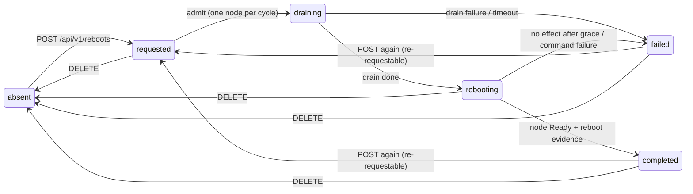

# simplek8s-controller

A node-management controller for self-built Kubernetes clusters
(SimpleK8s distro: Buildroot, systemd, containerd, kubeadm). It runs as a privileged
DaemonSet with one instance per node and provides operational
capabilities over the hosts.

First capability (v1): **node reboots** with a concurrency
limit, availability waiting, and PodDisruptionBudget awareness.

- Project: https://simplek8s.org
- Repo: https://github.com/simplek8s/simplek8s-controller
- Go 1.27, stdlib only (no client-go, no controller-runtime).

Design: [PLAN-M1.md](PLAN-M1.md) (node reboots, shipped) and [PLAN-M2.md](PLAN-M2.md) (distro updates, in planning). Deviations found during implementation: [PLAN.FIXME.md](PLAN.FIXME.md).

## How it works

One binary, two roles per pod:

- **Executor** (every pod, own node only): when its node enters
  `rebooting`, it records `reboot-exec` (issuedAt, host boot ID, attempt,
  pod UID) in one annotation patch and then runs
  `nsenter -t 1 -m -u -i -n -p -- reboot`. After the reboot it comes
  back, compares the host boot ID with the recorded one, and stamps
  `reboot-exec.confirmedAt` if it changed.
- **Orchestrator** (leader only, elected via the
  `simplek8s-controller-leader` coordination.k8s.io Lease in the
  controller's namespace): runs the lifecycle — admission from `requested`
  to `draining`, drain (cordon + eviction, PDB-aware), the
  `draining`→`rebooting` transition, completion detection, and uncordon.

All lifecycle state lives in **four Node annotations** (prefix
`simplek8s.org/`), so a dead controller, a leader change, or even a node
rejoining with a fresh kubelet never loses state:

| Annotation | Content |
|---|---|
| `simplek8s.org/reboot-state` | `{"state":"requested\|draining\|rebooting\|completed\|failed","since":"<RFC3339>"}` |
| `simplek8s.org/reboot-request` | `{"id":"<req-id>","by":"<requestedBy>","force":false}` |
| `simplek8s.org/reboot-exec` | `{"issuedAt":"...","bootId":"...","attempt":1,"executorPodUID":"...","confirmedAt":null}` |
| `simplek8s.org/reboot-status` | `{"blockedBy":["<pdb>..."],"error":"...","cordonedPrev":true}` |

`cordonedPrev` records whether the node was already cordoned before the
controller touched it; the controller only uncordons nodes it cordoned.

### Lifecycle



Queue gates while `requested`: at most `--max-concurrent-reboots` nodes
in flight, at most 1 control plane, PDB-blocked nodes wait (unless
`force`), a requested node that is NotReady holds the queue. DELETE is
**not** available on `draining` (409: an in-flight drain is not
interruptible — wait out `--reboot-drain-timeout`).

Completion evidence: the leader transitions `rebooting`→`completed` only
when the node is Ready **and** either the local pod confirmed the boot ID
change (`confirmedAt`) or the leader itself observed the node NotReady
after `issuedAt` (covers the executor pod dying before confirming).

## Deployment

```sh
make image            # docker build (VERSION/COMMIT/BUILT baked in)
make deploy           # kubectl apply -k deploy/ (uses your kubeconfig)
```

`deploy/` is a kustomize bundle: namespace, ServiceAccount, RBAC,
DaemonSet, Service, NetworkPolicy. **The API token Secret is
deliberately not in the bundle** — create it with real material first:

```sh
kubectl -n simplek8s create secret generic simplek8s-api-token \
  --from-literal=token="$(openssl rand -hex 32)"
```

Without `SIMPLEK8S_API_TOKEN` the binary refuses to start (the API is
never tokenless by design).

### Flags (DaemonSet args)

| Flag | Default | Meaning |
|---|---|---|
| `--max-concurrent-reboots` | `1` | in-flight reboot nodes at once (hard limit 1 for control planes) |
| `--on-reboot-failure` | `pause` | `pause`: queue halts while any node is `failed` (clear with DELETE). `continue`: a drain timeout proceeds to reboot anyway |
| `--reboot-drain-timeout` | `10m` | wall-clock cap on the drain phase |
| `--reboot-issue-grace` | `5m` | window to re-issue the reboot command after a crash between the annotation patch and `nsenter`; if the boot ID is still unchanged after it, the node goes to `failed` |
| `--engine-interval` | `2s` | poll period |
| `--listen` | `:8080` | API bind address |

## Scheduling reboots (API)

Plain HTTP on the pod port (Service `simplek8s-controller` in namespace
`simplek8s`). No TLS: reach it via port-forward or a trusted network;
every mutating/reading endpoint (except `/livez`, `/readyz`) requires
`Authorization: Bearer <token>`.

```sh
# schedule reboots for specific nodes (or all nodes with "*")
curl -X POST -H "Authorization: Bearer $TOKEN" \
  -H 'Content-Type: application/json' \
  -d '{"nodes":["node-1","node-2"],"requestedBy":"jls","force":false}' \
  http://127.0.0.1:1880/api/v1/reboots

# what is in flight / pending
curl -H "Authorization: Bearer $TOKEN" http://127.0.0.1:1880/api/v1/reboots

# one node
curl -H "Authorization: Bearer $TOKEN" http://127.0.0.1:1880/api/v1/reboots/node-1

# clear a node's reboot state (see semantics below)
curl -X DELETE -H "Authorization: Bearer $TOKEN" http://127.0.0.1:1880/api/v1/reboots/node-1
```

`POST` always answers **202** with a partial result
(`{"accepted":[...],"rejected":[{"node","code","reason"}]}`); per-node
rejections: `404` unknown node, `422` node not Ready or controller pod
not Running on it, `409` state not re-requestable (currently
`requested`/`draining`/`rebooting`, or a corrupt state), `503` API
server unreachable.

`DELETE` semantics (per fresh state): `requested` → clear (any cordon is
the operator's, left alone); `draining` → **409, not interruptible**
(wait it out or wait for the drain timeout); `rebooting`/`completed`/
`failed` → clear the four annotations and uncordon **only if the
controller was the one that cordoned** (`cordonedPrev` known absent);
corrupt state → guaranteed uniform clear, no uncordon. Success is
`204`.

## Observing state

```sh
# one-liners (all nodes)
kubectl get nodes -o jsonpath='{range .items[*]}{.metadata.name}{"\t"}{.metadata.annotations.simplek8s\.org/reboot-state}{"\n"}{end}'
kubectl get nodes -o jsonpath='{range .items[*]}{.metadata.name}{"\t"}{.metadata.annotations.simplek8s\.org/reboot-request}{"\n"}{end}'

# one node, pretty
kubectl get node node-1 -o json | jq .metadata.annotations.'simplek8s.org/reboot-state'

# controller events (lifecycle reasons: RebootDraining, RebootIssued,
# RebootCommandIssued, RebootCompleted, RebootFailed, PDBBlocked,
# QueuePaused, QueueHeldNotReady, CorruptRebootState, NodeDisappeared,
# UncordonBlocked). They live in the "default" namespace: Node is a
# cluster-scoped subject and the API server requires its events there
# (same place as kubelet's node events).
kubectl -n default get events --sort-by=.metadata.creationTimestamp
kubectl -n default get events --field-selector "involvedObject.name=node-1"

# controller logs
kubectl -n simplek8s logs -l app=simplek8s-controller --tail=50
```

## Failure handling, pause/resume, hand repair

- **Queue paused**: with `--on-reboot-failure=pause`, any node in
  `failed` halts the queue (`QueuePaused` event). Resume by clearing the
  node: `DELETE /api/v1/reboots/<node>`.
- **Drain stuck**: evictions can wait for `terminationGracePeriodSeconds`
  and PDBs. Escape hatches: wait out `--reboot-drain-timeout` (node goes
  to `failed` under `pause`, or proceeds under `continue`), or clear all
  four annotations by hand **and** `kubectl uncordon <node>`:

  ```sh
  kubectl annotate node <node> \
    simplek8s.org/reboot-state- simplek8s.org/reboot-request- \
    simplek8s.org/reboot-exec- simplek8s.org/reboot-status-
  kubectl uncordon <node>
  ```

- **Node that never returns** (bricked distro, hardware): it stays
  `rebooting`, holding its concurrency slot — the queue does not advance
  on its own, and no assumption is made about the node's fate.
  Visibility: `NotReady` + annotations + Events. Escape:
  `DELETE /api/v1/reboots/<node>`.
- **Corrupt state** (hand-edited annotation no longer parses): the node
  holds a concurrency slot and emits `CorruptRebootState` with both
  escapes. Repair the JSON in place, or clear via `DELETE` (guaranteed
  uniform clear, no uncordon).
- **Hand-repair caveat**: do **not** delete `simplek8s.org/reboot-status`
  whole when the node is cordoned — it holds `cordonedPrev`. Losing it
  flips the uncordon rule from "operator cordoned, leave it" to
  "controller cordoned, uncordon it" (or, for DELETE, from preserve to
  uncordon). Repair individual fields instead, e.g. clear only the error:

  ```sh
  kubectl annotate node <node> --overwrite \
    simplek8s.org/reboot-status='{"error":""}'
  ```

  (adjust to keep any `cordonedPrev`/`blockedBy` you need).
- **Uncordon blocked**: `UncordonBlocked` event means `reboot-status` is
  unreadable; the cordon is preserved until you repair the annotation or
  `kubectl uncordon` manually.

## Safety notes

- **Scheduling a reboot wipes the node's local ephemeral storage**
  (emptyDir, tmpfs, container writable layers). Unlike `kubectl drain`
  there is deliberately **no local-storage gate**: the reboot destroys
  that storage anyway, so the drain neither blocks on it nor evicts it
  differently. Schedule nodes carrying local-storage workloads with
  care; PDB-protected pods will block the drain regardless (unless
  `force`).
- **Control planes**: at most 1 CP node reboots at any time, and CP
  nodes always sort after workers in the queue. Rebooting a CP node of a
  single-CP cluster takes the API server down until the node returns;
  the controller's state is annotation-derived, so it resumes cleanly
  afterwards, but expect the cluster to be unavailable during the gap.
- **API transport**: plain HTTP with a bearer token. Keep the Service
  inside the cluster (the shipped NetworkPolicy restricts ingress); do
  not expose it publicly without TLS termination.
- **Privilege**: the DaemonSet pod is privileged (it must reach PID 1's
  namespaces to issue `reboot`). Treat the `simplek8s` namespace and its
  token Secret accordingly.

## Development

```sh
make            # vet + test + build
make test       # go test ./...
make image      # docker image with version/commit/built baked in
make deploy-minikube   # build + apply + refresh image on minikube
```

Layout:

```
cmd/simplek8s-controller/   entrypoint (flags, env, wiring)
internal/kube/              stdlib REST client + minimal K8s types
internal/nodestate/         the four annotations: schema, parse, patches
internal/engine/            poll loop, leader election (Lease), roles
internal/features/reboot/   orchestrator, executor, drain, PDB
internal/api/               HTTP API (token auth, reboots endpoints)
internal/kubetest/          fake API server for tests (stdlib only)
deploy/                     kustomize bundle
```
