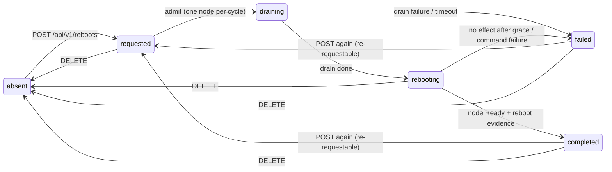

# simplek8s-controller

[](https://github.com/simplek8s/simplek8s-controller/actions/workflows/ci.yml)
[](https://github.com/simplek8s/simplek8s-controller/pkgs/container/simplek8s-controller)

A node-management controller for self-built Kubernetes clusters
(SimpleK8s distro: Buildroot, systemd, containerd, kubeadm). It runs as a privileged
DaemonSet with one instance per node and provides operational
capabilities over the hosts.

First capability (v1): **node reboots** with a concurrency
limit, availability waiting, and PodDisruptionBudget awareness.

- Project: <https://simplek8s.org>
- Repo: <https://github.com/simplek8s/simplek8s-controller>
- Go 1.27, no client-go, no controller-runtime. Direct dependencies
  are two (both for release verification/payloads, added with updates):
  `ProtonMail/go-crypto` (GPG) and `klauspost/compress` (zstd).

Design: [PLAN.md](PLAN.md) — the single living design doc (shipped
behavior + current plan). Historical plans (`PLAN-M1.md`, `PLAN-M2.md`,
`PLAN-M3.md`, the E2E campaign files, `PLAN.FIXME.md`) were folded into
it; their full text is in git history.

## How to install

Prerequisites: SimpleK8s-distro nodes, cluster-admin `kubectl`, `helm`.

```sh
# 0. Once: the namespace (skip the create if it exists). The labels
#    are what the privileged DaemonSet needs from PodSecurity
#    admission.
kubectl create namespace simplek8s
kubectl label namespace simplek8s \
  pod-security.kubernetes.io/enforce=privileged \
  pod-security.kubernetes.io/audit=restricted \
  pod-security.kubernetes.io/warn=restricted --overwrite

# 1. Install (inert by default: updates off, no reboot windows).
helm install simplek8s-controller oci://ghcr.io/simplek8s/charts/simplek8s-controller -n simplek8s --create-namespace

# 2. Verify every node has a Running pod:
kubectl -n simplek8s get pods -o wide
kubectl -n simplek8s logs -l app=simplek8s-controller --tail=3
```

Then give it work (Helm owns the ConfigMap — hand edits are
overwritten on the next `upgrade`):

```sh
helm upgrade simplek8s-controller ./chart -n simplek8s --reuse-values \
  --set config.updates.mode=stage
```

start with `stage` to just install updates without automatic node
reboots, and then consider `full` for automatic node reboots (see
"Distro updates" below).

## How it works

One binary, two roles per pod:

- **Executor** (every pod, own node only): when its node enters
  `rebooting`, it records `reboot-exec` (issuedAt, host boot ID, attempt,
  pod UID) in one annotation patch and then runs
  `nsenter -t 1 -m -u -i -n -p -- reboot`. After the reboot it comes
  back, compares the host boot ID with the recorded one, and stamps
  `reboot-exec.confirmedAt` if it changed.
- **Orchestrator** (leader only, elected via the
  `simplek8s-controller-leader` coordination.k8s.io Lease in the
  controller's namespace): runs the lifecycle — admission from `requested`
  to `draining`, drain (cordon + eviction, PDB-aware), the
  `draining`→`rebooting` transition, completion detection, and uncordon.

All lifecycle state lives in **four Node annotations** (prefix
`simplek8s.org/`), so a dead controller, a leader change, or even a node
rejoining with a fresh kubelet never loses state:

| Annotation | Content |
| --- | --- |
| `simplek8s.org/reboot-state` | `{"state":"requested\|draining\|rebooting\|completed\|failed","since":"<RFC3339>"}` |
| `simplek8s.org/reboot-request` | `{"id":"<req-id>","by":"<requestedBy>","force":false}` |
| `simplek8s.org/reboot-exec` | `{"issuedAt":"...","bootId":"...","attempt":1,"executorPodUID":"...","confirmedAt":null}` |
| `simplek8s.org/reboot-status` | `{"blockedBy":["<pdb>..."],"error":"...","cordonedPrev":true}` |

`cordonedPrev` records whether the node was already cordoned before the
controller touched it; the controller only uncordons nodes it cordoned.

### Lifecycle



Queue gates while `requested`: at most `reboots.max-concurrent` nodes
in flight, at most 1 control plane, PDB-blocked nodes wait (unless
`force`), a requested node that is NotReady holds the queue. DELETE is
**not** available on `draining` (409: an in-flight drain is not
interruptible — wait out `reboots.drain-timeout`).

Completion evidence: the leader transitions `rebooting`→`completed` only
when the node is Ready **and** either the local pod confirmed the boot ID
change (`confirmedAt`) or the leader itself observed the node NotReady
after `issuedAt` (covers the executor pod dying before confirming).

## Deployment

```sh
make image            # docker build (VERSION/COMMIT/BUILT baked in)
make deploy           # helm upgrade --install (uses your kubeconfig)
```

`chart/` is a Helm chart: ServiceAccount, RBAC, ConfigMap,
DaemonSet — no Service by design (reach the API via
`kubectl port-forward`, see below), and no Namespace either (it often
holds other things and uninstalling must never delete it; the chart
never manages it). Pin the image per release in PROD:

```sh
helm install simplek8s-controller ./chart -n simplek8s --create-namespace \
  --set image.tag=vX.Y.Z
```

**The API token Secret is optional**: without it the pods still start
and the API serves loopback clients only (i.e. `kubectl port-forward`);
with it, every endpoint but the probes additionally requires its
bearer. Helm-managed (`--set secret.create=true`, stable across
upgrades), or by hand:

```sh
kubectl -n simplek8s create secret generic simplek8s-controller-api-token \
  --from-literal=token="$(openssl rand -hex 32)"
```

Rotation: update the Secret and `kubectl rollout restart -n simplek8s
daemonset/simplek8s-controller` (the token is read once at startup).

Uninstall keeps the namespace (the chart never manages it):

```sh
helm uninstall simplek8s-controller -n simplek8s
```

Canary on one node (what the old `prod-canary` overlay did):

```sh
helm install simplek8s-controller ./chart -n simplek8s --create-namespace \
  --set image.tag=vX.Y.Z \
  --set nodeSelector."kubernetes\.io/hostname"=rpi4-node
```

### Configuration (ConfigMap)

Feature configuration lives in the flat-key ConfigMap
`simplek8s-controller` (namespace `simplek8s`), re-read at the start of
every engine cycle. All values are strings; absent keys fall back to
the built-in defaults, an absent ConfigMap runs entirely on defaults,
and an invalid value keeps the previous one (with a warning) — a config
typo never crashes the controller.

| Key | Default | Meaning |
| --- | --- | --- |
| `engine.interval` | `2s` | engine poll period |
| `reboots.max-concurrent` | `1` | in-flight reboot nodes at once (hard limit 1 for control planes) |
| `reboots.on-failure` | `pause` | `pause`: queue halts while any node is `failed` (clear with DELETE). `continue`: a drain timeout proceeds to reboot anyway |
| `reboots.drain-timeout` | `10m` | wall-clock cap on the drain phase |
| `reboots.issue-grace` | `15m` | window to re-issue the reboot command after a crash between the annotation patch and `nsenter`; if the boot ID is still unchanged after it, the node goes to `failed` |
| `updates.mode` | `off` | `off`: no release checks or staging (per-node `next-kernel` boot intent is still honored). `stage`: check + verified staging, no auto-reboot. `full`: staging + window-gated automatic reboots (no plans — the local pod enqueues the node into the M1 queue while a window is open) |
| `updates.url` | `https://dl.simplek8s.org/simplek8s/stable` | release repo (root of `SHA256SUMS` + `SHA256SUMS.gpg`). Overridable per node with the `simplek8s.org/update-url` annotation |
| `updates.preserve` | `3` | how many released versions are immune to purge on the boot partition after a successful update (the running version is never purged; purge only runs under space pressure) |
| `updates.max-percent-usage` | `75` | after an update, purge oldest versions until the boot partition usage is at or below this percentage |
| `reboots.windows` | `[]` | cron-style maintenance windows gating **every** non-forced reboot (M1 API + update-driven). Empty = OFF (non-forced `POST` is rejected with 422). Example: `'["@daily"]'` |
| `reboots.window-grace` | `5m` | how long a reboot window stays open after each schedule occurrence |
| `updates.windows` | `'["@every 12h"]'` | windows gating the update *work* (checks, downloads, staging). Explicit `[]` turns updates fully off; absent means the 12h default. One check per window occurrence |
| `updates.window-grace` | `5m` | how long an update window stays open after each schedule occurrence |

Deployment wiring is not feature configuration and stays as a flag:
`--listen` (default `:8080`, API bind address).

## Distro updates

The update feature stages new SimpleK8s releases on each node's boot
partition and (in `full` mode) reboots the node into them through the
M1 queue — gated by maintenance windows. It is tuned by
`updates.mode` and gated by `updates.windows` /
`reboots.windows`:

- **`off`** (default): inert. No release checks, downloads or staging.
  A per-node `next-kernel` already set is still honored at boot, and
  the bootloader reconciliation still re-points it.
- **`stage`**: check + GPG/sha256-verified staging of the newest release +
  `next-kernel := V`. No automatic reboot — the operator reboots via the
  M1 API when ready.
- **`full`**: staging **plus** automatic reboots: while a
  `reboots.windows` window is open, each node's local pod enqueues it
  into the M1 reboot queue (serialization, PDB and CP rules unchanged).
  There is no plan object: pending state is derived from `next-kernel`
  vs `running` + the M1 state, and verification is per node
  (`UpdateApplied` / `UpdateMismatch`, no auto-retry).

Windows are cron-style schedule lists (Vixie syntax, see PLAN.md §3.3)
plus a grace period, evaluated against the UTC clock; only the *start*
of work is gated, in-flight work always runs to completion. Defaults:
`reboots.windows` empty (reboots opt-in — non-forced `POST` without a
window is rejected), `updates.windows` one check per 12h. An explicit
`updates.windows: '[]'` turns the update work fully off; `force`
bypasses the reboot window like it bypasses PDB.

### Release source

The global repo is `updates.url` (root of `SHA256SUMS` +
`SHA256SUMS.gpg`, GPG-verified). A node can override it with the
`simplek8s.org/update-url` annotation. Every release file is verified
against the signed index (sha256) before it is staged — an untrusted repo
can never write to the boot partition.

### The two operator annotations

| Annotation | Meaning |
| --- | --- |
| `simplek8s.org/next-kernel` | Per-node **boot intent**: the release version the node should boot. Always a version present in the boot partition's `simplek8s/` dir. Written by the updater (staging, safe-state correction) and the operator (pin/rollback). Deleted only when no local kernel remains (safe-state case). |
| `simplek8s.org/update-url` | Per-node release repo override (takes precedence over `updates.url`). |
| `simplek8s.org/update-last-check` | Newest checked window occurrence (RFC3339 UTC), written by the local pod before each check — at most one check per occurrence, crash-safe. Read-only for operators. |

(The M2 `simplek8s.org/reboot-eligible` marker is abolished: eligibility
is derived, and any leftover is deleted by the pod at startup. Do not
set either annotation but `next-kernel`/`update-url` by hand.)

### Deferring and abandoning auto-reboots

`DELETE /api/v1/reboots/<node>` cancels the **currently queued attempt**
but does not suppress the automatic intent while the node stays eligible
(non-quiescent, `full` mode): the node is re-enqueued at the next open
`reboots.windows` (defer, not abandon). To abandon the intent, make the
node quiescent — reboot it into the pinned version manually, or re-pin
`next-kernel` to `running`. A `failed` node is an operator alarm and is
never auto-enqueued; a `completed` node whose kernel did not take is
never auto-retried (`UpdateMismatch` tells you).

### Rollback

Set `next-kernel` back to the currently running version and reboot; the
old kernel is always kept (the purge never deletes the running version):

```sh
kubectl annotate node <node> --overwrite simplek8s.org/next-kernel=<running-V>
```

### Unbootable kernel recovery

A kernel that is correctly signed and staged can still fail to boot on
a given node (distro QA owns bootability; the controller cannot
distinguish this case in advance). There is no automatic fallback:
syslinux drops to a `boot:` prompt and the node sits `rebooting` +
`NotReady` (past `reboots.issue-grace`, that shape is the
signal — a healthy reboot flaps Ready for ~1–2 min). Recover via the
machine console:

1. At the `boot:` prompt, type a good entry name
   (`simplek8s.<ts>.<arch>`, any kernel file present on the boot
   partition) + Enter. This was proven live (W13).
2. The node lands `completed`+`UpdateMismatch` (goal ≠ running) — no
   auto-retry fires.
3. Repair the bad file (delete it and let the next occurrence re-stage
   it from the verified index, or copy a good one over it), re-pin
   `next-kernel` to `running`, DELETE the state → quiescent.

Prevention without new code: roll out in `stage` mode and reboot nodes
one by one through the M1 API (canary), switching to `full` only after
the release has proven bootable on your hardware.

### Keyring override

The image embeds the distro public key at
`/etc/simplek8s/pubring.gpg`. To verify a **custom** release repo signed by
a **custom** key, create a Secret (mounted read-only at
`/etc/simplek8s/custom/pubring.gpg`; when the file exists it wins over the
embedded one):

```sh
kubectl -n simplek8s create secret generic simplek8s-controller-keyring \
  --from-file=pubring.gpg=/path/to/custom-pubring.gpg
```

Then set `updates.url` (or the per-node `update-url` annotation) to the
custom repo. Absent Secret → the embedded keyring is used.

### Observing updates

Updates emit the same kinds of Node Events as reboots, in the `default`
namespace: `UpdateAvailable`, `UpdateStaged`, `UpdateStagingSkipped`,
`UpdateApplied`, `UpdateMismatch`, `UpdateGoalCorrected`,
`UpdateHeldWindow`, `QueueHeldWindow`. Inspect per node with:

```sh
kubectl -n default get events --field-selector "involvedObject.name=<node>"
```

> **UTC note**: all timestamps the feature uses — release versions
> (`<ts>`), annotation `since` values, `update-last-check` claims — are
> **UTC** (RFC3339 `Z`). The distro's release tooling stamps UTC; do not
> compare against local time.

## Scheduling reboots (API)

Plain HTTP on the pod port. No Service exists by design and there is
no TLS: reach it with `kubectl port-forward` (your own credentials,
RBAC and audit apply), never exposed; with the token Secret present,
every mutating/reading endpoint (except `/livez`, `/readyz`) requires
`Authorization: Bearer <token>` — without it, only loopback clients
(the port-forward path itself) are served and direct cluster traffic
gets 403.

```sh
kubectl port-forward -n simplek8s daemonset/simplek8s-controller 1880:8080 &
# schedule reboots for specific nodes (or all nodes with "*")
curl -X POST -H "Authorization: Bearer $TOKEN" \
  -H 'Content-Type: application/json' \
  -d '{"nodes":["node-1","node-2"],"requestedBy":"jls","force":false}' \
  http://127.0.0.1:1880/api/v1/reboots

# what is in flight / pending
curl -H "Authorization: Bearer $TOKEN" http://127.0.0.1:1880/api/v1/reboots

# one node
curl -H "Authorization: Bearer $TOKEN" http://127.0.0.1:1880/api/v1/reboots/node-1

# clear a node's reboot state (see semantics below)
curl -X DELETE -H "Authorization: Bearer $TOKEN" http://127.0.0.1:1880/api/v1/reboots/node-1
```

`POST` always answers **202** with a partial result
(`{"accepted":[...],"rejected":[{"node","code","reason"}]}`); per-node
rejections: `404` unknown node, `422` node not Ready or controller pod
not Running on it, `409` state not re-requestable (currently
`requested`/`draining`/`rebooting`, or a corrupt state), `503` API
server unreachable.

`DELETE` semantics (per fresh state): `requested` → clear (any cordon is
the operator's, left alone); `draining` → **409, not interruptible**
(wait it out or wait for the drain timeout); `rebooting`/`completed`/
`failed` → clear the four annotations and uncordon **only if the
controller was the one that cordoned** (`cordonedPrev` known absent);
corrupt state → guaranteed uniform clear, no uncordon. Success is
`204`.

## Observing state

```sh
# one-liners (all nodes)
kubectl get nodes -o jsonpath='{range .items[*]}{.metadata.name}{"\t"}{.metadata.annotations.simplek8s\.org/reboot-state}{"\n"}{end}'
kubectl get nodes -o jsonpath='{range .items[*]}{.metadata.name}{"\t"}{.metadata.annotations.simplek8s\.org/reboot-request}{"\n"}{end}'

# one node, pretty
kubectl get node node-1 -o json | jq .metadata.annotations.'simplek8s.org/reboot-state'

# controller events (lifecycle reasons: RebootDraining, RebootIssued,
# RebootCommandIssued, RebootCompleted, RebootFailed, PDBBlocked,
# QueuePaused, QueueHeldNotReady, CorruptRebootState, NodeDisappeared,
# UncordonBlocked). They live in the "default" namespace: Node is a
# cluster-scoped subject and the API server requires its events there
# (same place as kubelet's node events).
kubectl -n default get events --sort-by=.metadata.creationTimestamp
kubectl -n default get events --field-selector "involvedObject.name=node-1"

# controller logs
kubectl -n simplek8s logs -l app=simplek8s-controller --tail=50
```

## Failure handling, pause/resume, hand repair

- **Queue paused**: with `reboots.on-failure: pause`, any node in
  `failed` halts the queue (`QueuePaused` event). Resume by clearing the
  node: `DELETE /api/v1/reboots/<node>`.
- **Drain stuck**: evictions can wait for `terminationGracePeriodSeconds`
  and PDBs. Escape hatches: wait out `reboots.drain-timeout` (node goes
  to `failed` under `pause`, or proceeds under `continue`), or clear all
  four annotations by hand **and** `kubectl uncordon <node>`:

  ```sh
  kubectl annotate node <node> \
    simplek8s.org/reboot-state- simplek8s.org/reboot-request- \
    simplek8s.org/reboot-exec- simplek8s.org/reboot-status-
  kubectl uncordon <node>
  ```

- **Node that never returns** (bricked distro, hardware): it stays
  `rebooting`, holding its concurrency slot — the queue does not advance
  on its own, and no assumption is made about the node's fate.
  Visibility: `NotReady` + annotations + Events. Escape:
  `DELETE /api/v1/reboots/<node>`.
- **Corrupt state** (hand-edited annotation no longer parses): the node
  holds a concurrency slot and emits `CorruptRebootState` with both
  escapes. Repair the JSON in place, or clear via `DELETE` (guaranteed
  uniform clear, no uncordon).
- **Hand-repair caveat**: do **not** delete `simplek8s.org/reboot-status`
  whole when the node is cordoned — it holds `cordonedPrev`. Losing it
  flips the uncordon rule from "operator cordoned, leave it" to
  "controller cordoned, uncordon it" (or, for DELETE, from preserve to
  uncordon). Repair individual fields instead, e.g. clear only the error:

  ```sh
  kubectl annotate node <node> --overwrite \
    simplek8s.org/reboot-status='{"error":""}'
  ```

  (adjust to keep any `cordonedPrev`/`blockedBy` you need).
- **Uncordon blocked**: `UncordonBlocked` event means `reboot-status` is
  unreadable; the cordon is preserved until you repair the annotation or
  `kubectl uncordon` manually.

## Safety notes

- **Scheduling a reboot wipes the node's local ephemeral storage**
  (emptyDir, tmpfs, container writable layers). Unlike `kubectl drain`
  there is deliberately **no local-storage gate**: the reboot destroys
  that storage anyway, so the drain neither blocks on it nor evicts it
  differently. Schedule nodes carrying local-storage workloads with
  care; PDB-protected pods will block the drain regardless (unless
  `force`).
- **Control planes**: at most 1 CP node reboots at any time, and CP
  nodes always sort after workers in the queue. Rebooting a CP node of a
  single-CP cluster takes the API server down until the node returns;
  the controller's state is annotation-derived, so it resumes cleanly
  afterwards, but expect the cluster to be unavailable during the gap.
- **API transport**: plain HTTP with a bearer token, reachable only
  via `kubectl port-forward` (no Service, no TLS); do not expose the pod
  port publicly without TLS termination.
- **Privilege**: the DaemonSet pod is privileged (it must reach PID 1's
  namespaces to issue `reboot`). Treat the `simplek8s` namespace and its
  token Secret accordingly.

## Development

```sh
make            # vet + test + build
make test       # go test ./...
make image      # docker image with version/commit/built baked in
make deploy     # helm upgrade --install ./chart (TAG=vX.Y.Z pins the image)
```

CI (`.github/workflows/`) runs `gofmt` check + `vet` + `test` + `build`
on every push and PR. Pushing a branch also publishes a multi-arch
(`amd64`/`arm64`) image to GHCR after tests pass (branch name as tag).
Pushing a `vX.Y.Z` tag publishes the versioned image (`X.Y.Z`, `X.Y`,
`X`, `latest`), pushes the chart (`oci://ghcr.io/simplek8s/charts/simplek8s-controller`,
same version) and creates the GitHub Release with static binaries.

Layout:

```text
cmd/simplek8s-controller/   entrypoint (flags, env, wiring)
internal/config/            flat-key ConfigMap config (defaults, last-valid-wins)
internal/kube/              stdlib REST client + minimal K8s types
internal/nodestate/         node annotations: schema, parse, patches
internal/engine/            poll loop, leader election (Lease), roles
internal/features/reboot/   orchestrator, executor, drain, PDB
internal/features/update/   release check (verified index), staging, bootloader writers
internal/api/               HTTP API (token auth, reboots endpoints)
internal/kubetest/          fake API server for tests (stdlib only)
chart/                      Helm chart (ServiceAccount, RBAC, ConfigMap,
                              DaemonSet, optional Secret)
```

## License

Licensed under the Apache License, Version 2.0 — see [LICENSE](LICENSE).
